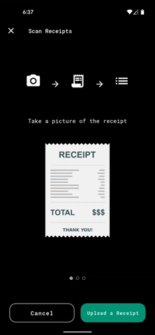

# **CCCC: Credit Card Calorie Counter**

### **Table of contents**
- [**CCCC: Credit Card Calorie Counter**](#cccc-credit-card-calorie-counter)
    - [**Table of contents**](#table-of-contents)
  - [**Introduction**](#introduction)
  - [**Features**](#features)
    - [**Link Bank Accounts and Fetch Transactions Data**](#link-bank-accounts-and-fetch-transactions-data)
    - [**Scan Receipt Image**](#scan-receipt-image)
  - [**Architecture**](#architecture)


## **Introduction**
CCCC is an food-focused expense tracking application built with [Flutter], [Firebase], and [Plaid API]. 

This project uses the following technologies:
- Dart and [Flutter] for building mobile application
- [Firebase Cloud Firestore] for NoSQL Database
- [Google Cloud Functions] for serverless functions
- [Plaid API] for connecting with bank accounts and fetching transactions data


## **Features**

### **Link Bank Accounts and Fetch Transactions Data**
   Open Plaid Link         |   Connect Bank Account    |     Fetch Transactions    |
:-------------------------:|:-------------------------:|:-------------------------:|
||


### **Scan Receipt Image**

  Screenshot               |
:-------------------------:|
|

Using [image_picker], Google ML Kit's [Text Recognition] function, and [Plaid API], I created a feature where users can scan the receipt image and match it with the transaction data from their debit/credit card.

1. Pick Image to scan using [image_picker] package

``` dart
import 'package:image_picker/image_picker.dart';

Future<File?> pickImage(ImageSource source) async {
  final image = await picker.pickImage(source: source);

  if (image != null) {
    final file = File(image.path);

    return file;
  } else {

    return null;
  }
}
```

2. Extract Texts and items from the file

``` dart
import 'package:google_ml_kit/google_ml_kit.dart';

Future<ReceiptResponse?> extractTexts() async {
  logger.d('File exists. Start using [GoogleMlKit]');

  final imageFile = pickImage(ImageSource.camera)
  final textDetector = GoogleMlKit.vision.textDetector();
  final inputImage = InputImage.fromFile(imageFile);
  final recognisedText = await textDetector.processImage(inputImage);
  final textsWithOffsets = _getTextsWithOffsets(recognisedText);
  final nestedLines = texts.blocks.map((e) => e.lines).toList();
  final textLines = nestedLines.expand((e) => e).toList();
  final textElements = textLines.expand((e) => e.elements).toList();
  final textElementsMap = textElements.map((e) => e.toMap).toList();
  
  final response = await functions.processReceiptTexts(
    rawTexts: recognisedText.text.replaceAll('\n', ', '),
    textsWithOffsets: textsWithOffsets,
  );

  return response;
}
```


## **Architecture**

```
lib/
│───constants/
│───extensions/
│───models/
│───routes/
│───services/
│───styles/
│───view_models/
│───views/
│───widget_models/
│───widgets/
└───main.dart
```

- constants: constant values such as urls, keys, etc
- extensions: custom extensions for `String` or `Enum`
- models: custom classes and enums
- routes: for routing within the app
- services: for using Firebase Authentication, Cloud Firestore, and Functions
- styles: app-level ThemeData, TextStyles, ButtonStyles, and Color Palette
- view: `Scaffold`-level ui components
- view_models: view model for each view scaffolds
- widgets: widgets that are used in view
  

[Flutter]: https://flutter.dev/
[Firebase]: https://firebase.google.com/
[Plaid API]: https://plaid.com/
[Firebase Cloud Firestore]: https://firebase.google.com/products/firestore
[Google Cloud Functions]: https://cloud.google.com/functions
[image_picker]: https://pub.dev/packages/image_picker
[Text Recognition]: https://developers.google.com/ml-kit/vision/text-recognition