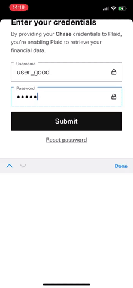

# **CCCC: Credit Card Calorie Counter**

### **Table of contents**
- [**CCCC: Credit Card Calorie Counter**](#cccc-credit-card-calorie-counter)
    - [**Table of contents**](#table-of-contents)
  - [**Introduction**](#introduction)
  - [**Features**](#features)
    - [Link Bank Accounts and Fetch Transactions Data](#link-bank-accounts-and-fetch-transactions-data)
    - [Scan Receipt Image Using Google ML and Python](#scan-receipt-image-using-google-ml-and-python)
  - [**Architecture**](#architecture)


## **Introduction**
CCCC is an food-focused expense tracking application built with [Flutter], [Firebase], and [Plaid API]. 

This project uses the following technologies:
- Dart and [Flutter] for building mobile application
- [Firebase Cloud Firestore] for NoSQL Database
- [Google Cloud Functions] for serverless functions
- [Plaid API] for connecting with bank accounts and fetching transactions data


## **Features**

### Link Bank Accounts and Fetch Transactions Data
   Open Plaid Link         |   Connect Bank Account    |     Fetch Transactions    |
:-------------------------:|:-------------------------:|:-------------------------:|
||

For this feature, I used 

### Scan Receipt Image Using Google ML and Python

   Android                 |           iOS           |
:-------------------------:|:-----------------------:|
|


## **Architecture**

```
lib/
│───constants/
│───extensions/
│───models/
│───routes/
│───services/
│───theme/
│───view/
│───view_models/
└───widgets/
```

- constants: constant values such as urls, keys, etc
- extensions: custom extensions for `String` or `Enum`
- models: custom classes and enums
- routes: for routing within the app
- services: for using Firebase Authentication, Cloud Firestore, and Functions
- theme: app-level ThemeData, TextStyle, buttonTheme, and Color Palette
- view: `Scaffold`-level ui components
- view_models: view model for each view scaffolds
- widgets: widgets that are used in view
  

[Flutter]: https://flutter.dev/
[Firebase]: https://firebase.google.com/
[Plaid API]: https://plaid.com/
[Firebase Cloud Firestore]: https://firebase.google.com/products/firestore?gclid=EAIaIQobChMIudGSjImI9QIVSkpyCh2BiwOAEAAYASAAEgI5bPD_BwE&gclsrc=aw.ds
[Google Cloud Functions]: https://cloud.google.com/functions