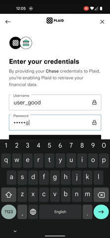
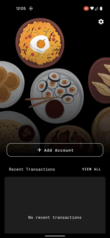

# CCCC: Expense Tracker
   Open Plaid Link         |   Connect Bank Account    |     Fetch Transactions    |
:-------------------------:|:-------------------------:|:-------------------------:|
||

## Introduction
CCCC is an expense tracking application built with [Plaid API].

This project uses the following technologies:
- Dart and [Flutter] for building mobile application
- [Firebase Cloud Firestore] for NoSQL Database
- [Google Cloud Functions] for serverless functions
- [Plaid API] for connecting with bank accounts and fetching transactions

[Flutter]: https://flutter.dev/
[Firebase]: https://firebase.google.com/
[Plaid API]: https://plaid.com/
[Firebase Cloud Firestore]: https://firebase.google.com/products/firestore?gclid=EAIaIQobChMIudGSjImI9QIVSkpyCh2BiwOAEAAYASAAEgI5bPD_BwE&gclsrc=aw.ds
[Google Cloud Functions]: https://cloud.google.com/functions